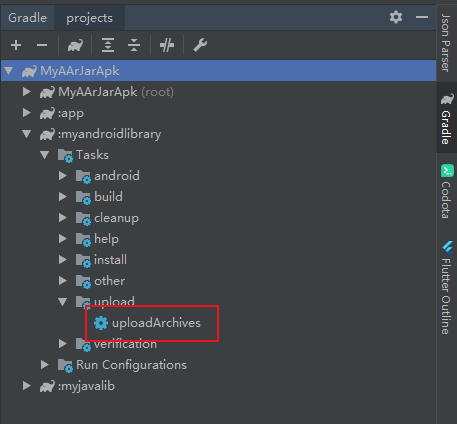
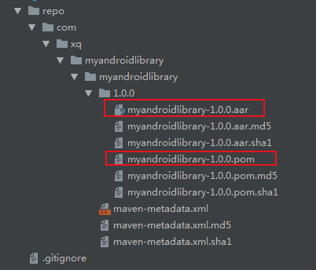

# arr和jar的区别

jar:仅打包了class文件和配置清单文件，其res等资源文件并没有打包。适合传统的Java或者没有资源文件的Android项目。

arr:打包了所有的class、res等资源文件。适合Android项目。

# 生成方式：
```  
在module下执行assemble或者assembleRelease
```

# 生成路径：
``` 
apk：                    apply plugin: 'com.android.application'
moduleName/build/outputs/apk

jar(推荐使用Java Module) ：apply plugin: 'java-library'
moduleName/build/libs

aar(推荐使用Android Module) ：apply plugin: 'com.android.library'
moduleName/build/outputs/aar

```

# 应用方式：

将aar或者jar包拷贝到【libs】文件夹中：

并将依赖
```
implementation fileTree(include: ['*.jar'], dir: 'libs')
```
修改为：
```
implementation fileTree(include: ['*.jar', '*.aar'], dir: 'libs')
```
然后sync一下项目即可。

# Androidstudio 打包aar 无法引用类库中 dependencies 远程依赖


module下创建maven.gradle:

``` 
//打包到本地Maven
apply plugin: 'maven'

//打包到本地Maven：设置maven deploy
uploadArchives {
    repositories {
        mavenDeployer {
            //设置插件的GAV参数
            pom.groupId = 'com.xq.myandroidlibrary'
            pom.artifactId = 'myandroidlibrary'
            pom.version = '1.0.0'
            //文件发布到下面目录
            repository(url: uri('../repo'))
        }
    }
}
```

module下的build.gradle：
``` 
apply from: 'maven.gradle'
```

执行gradle uploadArchives  或者点击右侧的upload/uploadArchives



生成的aar和pom文件：



然后在需要的module中引用即可：

```
implementation 'com.xq.myandroidlibrary:myandroidlibrary:1.0.0' 
```


